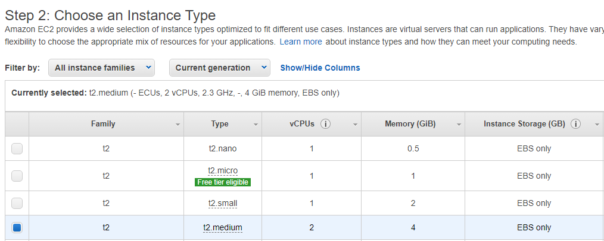

# GitHub - Jenkins - Docker - K8 Project

## Creating a Jenkins Server

For this project, you'll need an account with AWS, GitHub and Docker!

- Go to AWS and search for EC2
  
- Click on "Launch instance"
- Select an image type
- For this project we'll be using "Ubuntu Server 20.04"
- Select an instance type
  
- We'll be using t2.medium because micro will not be able to handle Jenkins and Kubernetes
- For the next few steps everything will stay as default
- For security group, add a "Custom TCP Rule" with port "8080"
  
- Now finish off by clicking "Review and Launch"
- If you don't have a key pair already, create a new key pair and download it onto your machine
- After the instance is up and running we'll need to connect to it
- Go onto the EC2 page and it'll have a list of any instances you're running
- Click on the Jenkins EC2 and select connect on the top right
- Click on "SSH client"
  
- As shown above click on the copy button under "Example:"
- Now open your terminal and direct to the folder that has your key pair from AWS (We can also write the absolute path instead)
- Paste the copied line and press enter
- You'll be asked the authenticate the host, type yes
- You've now successfully connected into your instance
- Now run these commands
```
- sudo apt-get update
- sudo apt install openjdk-11-jre-headless
- wget -q -O - https://pkg.jenkins.io/debian-stable/jenkins.io.key | sudo apt-key add -
- sudo sh -c 'echo deb https://pkg.jenkins.io/debian-stable binary/ > /etc/apt/sources.list.d/jenkins.list'  
- sudo apt-get update 
- sudo apt-get install jenkins
- sudo service jenkins status 
```
- After the last line is done it should have successfully installed Jenkins and shown the status as "Active"

- We can now go back onto the AWS dashboard
  
- If we now copy this Public IP address and open a new tab
- Paste this address with port ":8080" at the end
- This will now take you to Jenkins
  
- To get the password, copy the line in red
- Now go onto your terminal thats connected to the instance and type "sudo cat" and paste the copied line (ALL IN ONE COMMAND)
- Copy the output and paste it onto Jenkins
  
- Select "Install suggested plugins"
- Now create an Admin User
- If we go back onto the terminal now, we can give the Jenkins user, adminstrator roles so it can execute the shell script
- Run these commands
```
- sudo vi /etc/sudoers

- AT THE BOTTOM OF THAT FILE PASTE THE LINE BELOW: 
- jenkins ALL(ALL) NOPASSWD: ALL


- Can now switch to Jenkins user using:
- sudo su - jenkins
```
- Jenkins is now up and running!

## Installing Docker
- Docker is a simple installation
- In the terminal enter this command
```
- sudo apt install docker.io
- docker --version

- Adding jenkins user to the Docker group:
- sudo usermod -aG docker jenkins

```
## Adding credentials
- We need to add our GitHub and Docker credentials onto Jenkins so it can access it
- On Jenkins we need to go to Manage Jenkins -> Manage Credentials -> Stored scroped to Jenkins -> Global -> Add Credentials
- Select "Secret text" for "Kind"
- Enter your DockerHub password for "Secret"
- For the ID, enter "DOCKER_HUB_PASSWORD"
- For the description, you can put "Docker Hub Cred"
- Now to add GitHub credentials
- Select "Add Credentials"
- For "Kind" select "Username with password"
- Enter your GitHub username for "Username"
- Enter your GitHub password for "Password"
- For the ID, enter "GIT_HUB_CREDENTIALS"
- For the description, you can put "Git Hub Cred"
  
## Setting up AWS CLI
- This allows us to use Kubernetes 
- Run these commands in the terminal
```
- sudo apt install awscli

- Check if installed
- aws -- version
```
- After AWS CLI is installed we need to configure it to include our secret keys
- This is so it can authenticate the connection
```
- aws configure
```
- Now enter the following information it asks for
- This information can be found on AWS -> Security Credentials -> Access Keys
- Region can also be found on the top right corner

## Setting up kubectl and eksctl
- In the terminal run these commands
```
- curl -LO "https://storage.googleapis.com/kubernetes-release/release/$(curl -s https://storage.googleapis.com/kubernetes-release/release/stable.txt)/bin/linux/amd64/kubectl"
- chmod +x ./kubectl 
- sudo mv ./kubectl /usr/local/bin
```
- That was for Kubectl and to check if installed enter "kubectl version" 
```
- curl --silent --location "https://github.com/weaveworks/eksctl/releases/latest/download/eksctl_$(uname -s)_amd64.tar.gz" | tar xz -C /tmp
- sudo mv /tmp/eksctl /usr/local/bin 
```
- That was for eksctl and to check if installed enter "eksctl version"

## Creating a cluster
- In the terminal run this command
```
eksctl create cluster --name [{NAME OF CLUSTER}]--version 1.20 --region [{REGION}] --nodegroup-name [{NAME OF NODE}] --node-type [{NODE TYPE}] --nodes [{NO. OF NODES}]
```
- This step does take a while but all should be running after
- We can check this on AWS by searching for EKS -> Clusters

## Creating the Docker Image
- In your code editor, create a file called "Dockerfile"
- Inside this file, enter this piece of code 
```
FROM httpd:2.4
COPY ./public-html/ /usr/local/apache2/htdocs/
```

## Creating a YML file
- This file contains what will be deployed onto the cluster
- In this project, it is the docker image that will be deployed
- The docker image is a simple HTML page which we will create
- Create a yml file, my file is called apache.yml
- Enter this piece of code
```
apiVersion: apps/v1
kind: Deployment
metadata:
  name: apache
  namespace: default
spec:
  selector:
    matchLabels:
      app: apache
  replicas: 3
  template:
    metadata:
      labels:
        app: apache
    spec:
      containers:
        - name: apache
          image: fahimsg/docker-demo
          ports:
            - containerPort: 80
          imagePullPolicy: Always

---

apiVersion: v1
kind: Service
metadata:
  name: sev
spec:
  ports:
  - nodePort: 30001
    port: 80
    protocol: TCP
    targetPort: 80
  selector:
    app: apache
  type: NodePort
```
## Creating a HTML page
- For this project we've only created a simple HTML page
- From above you can see in my Dockerfile, the location I have for my HTML is in a folder called "public-html"
- You can also create this folder or name it whatever you wish
- Inside this folder is an HTML called "index.html"
- Copy this code for your "index.html"
```
<!DOCTYPE html>
<html>
<body>

<h1>Welcome To My Project!</h1>
<p>Hello my name is Fahim</p>
<p>Visit my <a href="https://github.com/FahimSG/Project">GitHub</a></p>

</body>
</html>
```
### Creating the pipeline on Jenkins
- We can now create the pipeline
- On Jenkins click on "New Item"
- After this select "Pipeline"
- Now you'll see a textbox for a pipeline script
- Paste this piece of code
```
node {
    stage("Clone Repo"){

        git branch: 'main', credentialsId: 'GIT_HUB_CREDENTIALS', url: '[{YOUR GITHUB URL}]'
    }


    stage("Docker"){
        sh 'docker version'
        sh 'docker build -t DOCKERUSERNAME/docker-demo .'
        sh 'docker image list'
    }

    withCredentials([string(credentialsId: 'DOCKER_HUB_PASSWORD', variable: 'PASSWORD')]) {
        sh 'docker login -u DOCKERUSERNAME -p $PASSWORD'
    }

    stage("Push Image to Docker Hub"){
        sh 'docker push  DOCKERUSERNAME/docker-demo'
    }
    
    stage("Kubenetes"){
        sh 'kubectl apply -f NAMEOFYML.yml'
    }
} 
```
- We can now run this job and it should all be working successfully!